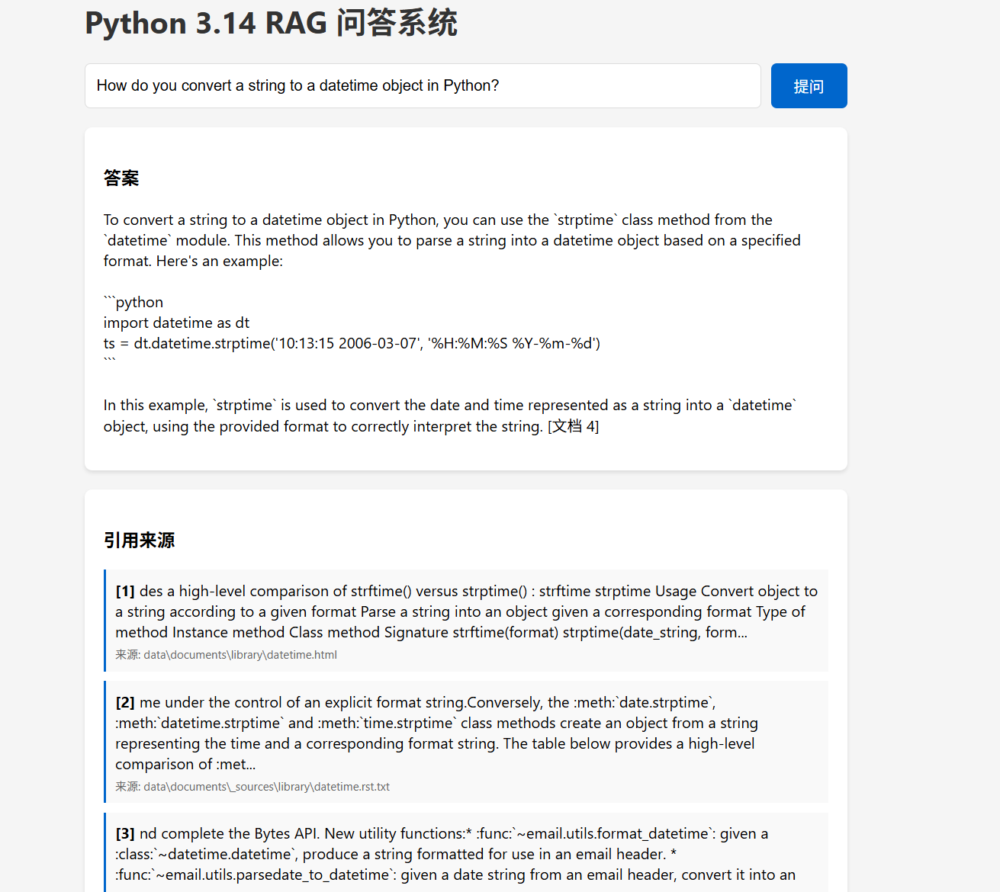
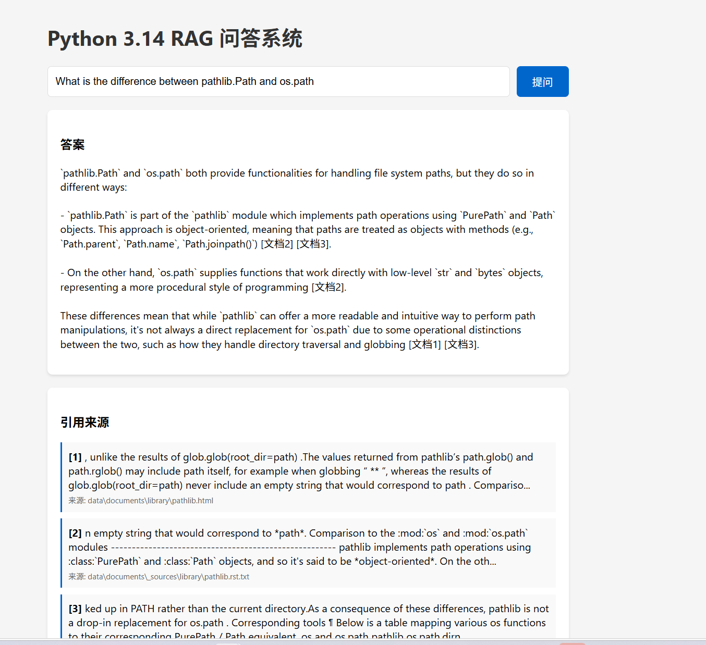
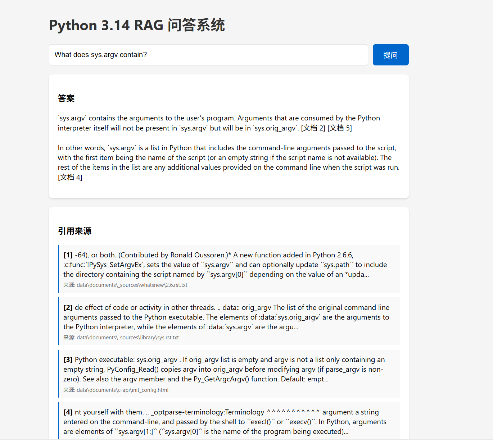
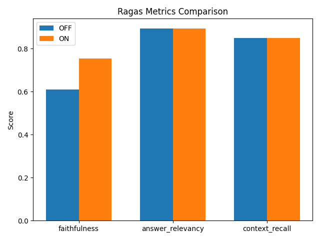
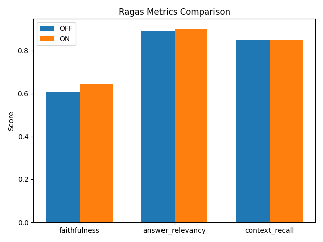
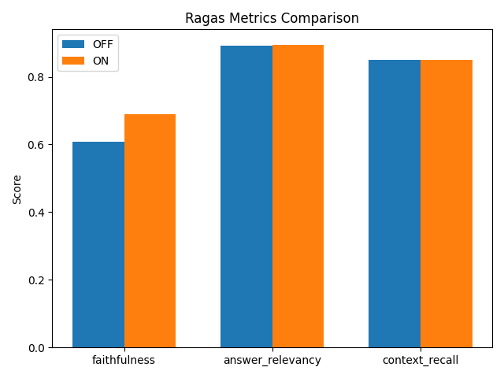

# 题目一：RAG混合检索与评估系统  
## Python 文档 RAG 问答系统

基于 Python 官方文档的可本地运行 RAG（Retrieval-Augmented Generation）问答系统，支持混合检索、Query 改写、重排序、流式 Web UI、Ragas 评估及消融实验。

## 核心特性

- **混合检索**：向量语义检索 + BM25 关键词检索双路召回，通过 RRF 融合
- **Query 改写**：LLM 驱动的多主题拆分与查询扩展，提升检索覆盖率
- **重排序**：基于 Cross-Encoder（`bge-reranker-v2-m3`）的精排优化
- **流式 Web UI**：基于 Flask + Server-Sent Events 的实时答案流式输出
- **Ragas 评估**：集成 `faithfulness`、`answer_relevancy`、`context_recall` 指标
- **消融实验**：支持一键对比 Query Rewrite、Rerank 及联合策略的效果

## 技术栈

- **语言**：Python 3
- **Web 框架**：Flask
- **向量数据库**：ChromaDB
- **Embedding**：`sentence-transformers`（Qwen3-Embedding-0.6B）
- **稀疏检索**：`rank-bm25`
- **重排序**：`sentence-transformers` CrossEncoder（bge-reranker-v2-m3）
- **LLM 客户端**：`openai` SDK（兼容 DashScope / 通义千问）
- **评估**：Ragas

---

## 技术选型理由

由于时间紧迫，且硬件资源有限，因此技术、模型的选择以轻量快速为主要选择理由。

### 语料：Python 官方 Sphinx HTML 文档

Python 官方文档结构清晰、权威性高，且以 Sphinx 生成的 HTML 形式提供，具有明确的 DOM 结构（`<div role="main">`、`<title>` 等标签），便于程序化解析。同时，Python 标准库模块众多、概念密集，非常适合验证 RAG 系统在复杂技术文档上的检索与生成能力。

### 解析器：BeautifulSoup + lxml

Python 生态中 `BeautifulSoup` 是最成熟的 HTML 解析库之一，API 简洁且容错性强；配合 `lxml` 解析引擎，能够高效处理 Sphinx 生成的大型 HTML 文件，并灵活地过滤导航栏、脚本、样式等无关内容。

### Embedding：本地 Qwen3-Embedding-0.6B

选择本地 Embedding 而非云端 API 的核心原因是**离线可用**与**成本可控**。`Qwen3-Embedding-0.6B` 是阿里开源的轻量级嵌入模型，参数量仅 0.6B，本地推理速度快、显存占用低，且在中文和英文技术文本上均有良好的语义表示能力，完全满足本项目对 512 字符 chunk 的编码需求。

### 向量数据库：ChromaDB

ChromaDB 是 Python 原生、零配置的嵌入式向量数据库，支持持久化存储（`PersistentClient`），API 极其简洁（`add` / `query` / `collection.count`），无需额外部署服务端进程。对于本项目的单机 RAG 场景，ChromaDB 在功能、易用性和性能之间取得了最佳平衡。

### 稀疏检索：rank-bm25

`rank-bm25` 是 BM25 算法的经典纯 Python 实现，零依赖、开箱即用。BM25 作为信息检索领域经过数十年验证的基线算法，在技术文档的关键词匹配上表现稳定可靠，无需训练即可直接使用。

### 融合策略：RRF（Reciprocal Rank Fusion）

RRF 被选中而非加权融合的核心原因是**鲁棒性**。BM25 返回的是原始 TF-IDF 风格分数，而向量检索返回的是余弦距离或 L2 距离，两者的数值分布和量纲完全不同，直接加权融合需要大量调参且对数据集敏感。RRF 只利用排名信息，天然消除了得分分布差异带来的问题，实现简洁且效果稳健。

### 重排序器：bge-reranker-v2-m3

`bge-reranker-v2-m3` 是 BAAI 开源的轻量级 Cross-Encoder 重排序模型，支持多语言，参数量适中，本地 CPU/GPU 均可流畅推理。它在语义相关性判断上的精度显著高于双塔式 Embedding，非常适合作为"最后一道筛选关卡"。

### LLM：通义千问 qwen-plus（DashScope）

选择通义千问的原因有三：

1. **中文理解能力强**：在技术文档问答场景中，对中英文混合内容的理解优于多数同规模模型。
2. **OpenAI 兼容接口**：DashScope 提供标准的 `/v1/chat/completions` 接口，可直接复用 `openai` SDK，无需额外适配客户端代码。
3. **稳定性与性价比**：qwen-plus 在推理质量与响应速度之间取得了良好平衡，适合作为 RAG 系统的生成后端。

### Web 框架：Flask

本项目的 Web 需求非常简单（一个单页前端 + 两个 API 端点），Flask 的轻量和灵活性完全符合需求。SSE（Server-Sent Events）流式输出在 Flask 中通过 `Response` 生成器即可实现，无需引入 WebSocket 的复杂性。

### 评估框架：Ragas

Ragas 是当前业界最成熟的 RAG 评估框架之一，提供了 `faithfulness`、`answer_relevancy`、`context_recall` 等标准化指标，且支持自定义 LLM 和 Embedding 后端。通过适配 `BaseRagasLLM` 和 `BaseRagasEmbeddings` 接口，可以将 Ragas 无缝接入本项目的本地模型和通义千问客户端。

---

## 快速开始

### 1. 环境准备

```bash
pip install -r requirements.txt
```

复制 `.env.example` 为 `.env` 并填入你的 API Key：

```bash
cp .env.example .env
# 编辑 .env，将 your_qwen_api_key_here 替换为实际的 API Key
```

### 2. 构建索引

```bash
python run.py --build-index
```

该命令会依次执行：

1. 解析 `documents/` 目录下的 HTML 文档
2. 将文档切分为 chunks
3. 使用 Embedding 模型编码并写入 ChromaDB
4. 构建 BM25 索引并序列化到本地

### 3. CLI 问答

```bash
python run.py --query "How does argparse handle subcommands?"
```

如需禁用 Query 改写以对比效果：

```bash
python run.py --query "你的问题" --no-query-rewrite
```

### 4. 启动 Web 服务

```bash
python run.py --web
# 或指定端口
python run.py --web --port 8080
```

浏览器访问 http://localhost:5000，支持流式输出与 Query 改写开关。

### 5. Ragas 评估

```bash
# 基线评估（关闭 Query Rewrite 与 Rerank）
python run.py --eval --config baseline

# 优化后评估（开启全部优化策略）
python run.py --eval --config optimized

# 生成对比图
python scripts/generate_comparison_chart.py
```

### 6. 消融实验

```bash
python run.py --ablation
```

将自动运行三组实验：仅 Query Rewrite、仅 Rerank、联合策略，并输出对比结果。

---

## 方案思路

本项目的设计遵循 **"召回优先、逐步精化、可控生成"** 的三层策略，核心目标是在纯本地环境（除 LLM 生成外）下，实现对 Python 官方文档的高精度问答。

在知识库文档选择上，选择了 20个文档，作为快速验证的知识来源。

```
argparse.html
asyncio.html
collections.html
datetime.html
functools.html
io.html
json.html
logging.html
os.html
pathlib.html
re.html
socket.html
sqlite3.html
sys.html
threading.html
typing.html
unittest.html
urllib.html
xml.etree.elementtree.html
zipfile.html
```

整个系统的设计遵循一个渐进漏斗：

```
大范围召回（Vector Top-50 + BM25 Top-50）
    → RRF 融合去重（Top-20）
    → 精排筛选（Rerank Top-5）
    → 约束生成（Prompt + 引用标注）
```

每一层都在前一层的基础上缩小范围、提升质量，确保最终进入 LLM 的上下文既全面又精准。

完整的系统设计、模块接口与数据流说明见 [`docs/plans/2026-04-28-rag-system-design.md`](docs/plans/2026-04-28-rag-system-design.md)。

---

## 系统架构

```
User Query
    |
    v
+------------------+
| Query Rewriter   |  LLM 多主题拆分 + 查询扩展
+------------------+
    |
    v
+------------------+     +------------------+
| Vector Retrieval |     | BM25 Retrieval   |
| (ChromaDB)       |     | (Okapi BM25)     |
| Top-50           |     | Top-50           |
+------------------+     +------------------+
    |                           |
    +-----------+---------------+
                |
                v
    +----------------------+
    | RRF Fusion (k=60)    |
    | Top-20               |
    +----------------------+
                |
                v
    +----------------------+
    | Reranker (optional)  |
    | Cross-Encoder        |
    | Top-5                |
    +----------------------+
                |
                v
    +----------------------+
    | Prompt Builder       |
    | Generator (LLM)      |
    +----------------------+
                |
                v
        Answer + Sources
```

---

## 文档解析与分块

### 支持格式

系统支持解析 **Sphinx 生成的 HTML 文档**（如 Python 官方文档）。解析器（`src/document_parser.py`）会提取 `<title>` 作为标题，并定位 `<div role="main">` 或 `<div class="body">` 提取正文，同时过滤掉 `script`、`style`、`nav`、`header`、`footer` 等无关标签。

### Chunk 参数

| 参数              | 值       | 说明                      |
| --------------- | ------- | ----------------------- |
| `CHUNK_SIZE`    | 512（字符） | 每个 chunk 的最大字符数         |
| `CHUNK_OVERLAP` | 100（字符） | 相邻 chunk 之间的重叠字符数，约 20% |

### 选择依据

- **格式特点**：Python 官方文档为 Sphinx 生成的结构化 HTML，段落级切分能够保留语义完整性。
- **Size 选择**：512 字符约为 250 个英文词，通常能覆盖一个完整的小节或一个独立的概念说明，既不会因过小而破坏上下文，也不会因过大而稀释检索精度。
- **Overlap 选择**：100 字符的 overlap 约等于一个短句的长度，可有效避免关键信息被截断在 chunk 边界，同时保证冗余度可控。

切分策略采用**递归字符切分**（`src/chunker.py`），优先按 `\n\n`（段落）、`\n`（换行）、` `（空格）寻找断点，尽量在语义边界处分割。

---

## 向量化与存储

### Embedding 模型

使用本地部署的 **`Qwen3-Embedding-0.6B`** 模型，通过 `sentence-transformers` 加载。该模型专为文本嵌入优化，在中文和英文场景下均有良好表现。

```python
from src.embedding import EmbeddingModel
model = EmbeddingModel()
embeddings = model.encode(texts)
```

### 向量库

向量数据持久化存储在 **ChromaDB**（`data/chroma_db`）中，采用 `PersistentClient` 模式，支持本地离线查询。集合（Collection）名称为 `python_docs`，存储内容包含：

- `documents`：原始 chunk 文本
- `embeddings`：对应的向量表示
- `metadatas`：来源文档名、标题等元信息

### 稀疏索引

除向量库外，系统同时使用 **BM25Okapi**（`rank-bm25`）构建稀疏索引，用于关键词匹配。索引构建后会通过 `pickle` 序列化到 `data/bm25_index.pkl`，启动时直接加载，无需重复构建。

---

## 混合检索（BM25 + 向量）

### 双路召回的正确实现

系统同时运行两路检索，互为补充，代码实现位于 `src/hybrid_retriever.py`：

1. **向量语义检索**：将查询文本编码为向量，在 ChromaDB 中执行近似最近邻搜索，取 **Top-50**（`config.TOP_K_VECTOR = 50`）。擅长捕捉语义相关性，对同义词、表述变体鲁棒。
   
   ```python
   query_embedding = self.embedding_model.encode([query])[0]
   vector_results = self.vector_store.query(query_embedding, top_k=config.TOP_K_VECTOR)
   ```

2. **BM25 关键词检索**：基于 Okapi BM25 对查询中的关键词进行精确匹配，取 **Top-50**（`config.TOP_K_BM25 = 50`）。擅长命中包含精确术语的文档片段。
   
   ```python
   bm25_results = self.bm25_index.query(query, top_k=config.TOP_K_BM25)
   ```

两路检索**独立运行、互不干扰**，确保各自的优势不被另一路的劣势所稀释。向量检索负责对查询意图进行语义泛化，BM25 负责确保精确术语不遗漏。

### 融合方式：RRF

两路结果通过 **Reciprocal Rank Fusion（RRF）** 合并，参数 `k=60`（`config.RRF_K = 60`），最终取 **Top-20**（`config.TOP_K_RRF = 20`）。

RRF 公式：

```
score(d) = Σ 1 / (k + rank_i(d))
```

其中 `rank_i(d)` 为文档 `d` 在第 `i` 路结果中的排名。实现代码位于 `src/hybrid_retriever.py`：

```python
def rrf_fusion(vector_results, bm25_results, k=60, top_k=20):
    scores = {}
    for rank, item in enumerate(vector_results):
        key = item.get("id", item.get("text"))
        scores[key] = {"score": 1.0 / (k + rank + 1), "item": item}
    for rank, item in enumerate(bm25_results):
        key = item.get("id", item.get("text"))
        if key in scores:
            scores[key]["score"] += 1.0 / (k + rank + 1)
        else:
            scores[key] = {"score": 1.0 / (k + rank + 1), "item": item}
    sorted_results = sorted(scores.values(), key=lambda x: x["score"], reverse=True)
    return [r["item"] for r in sorted_results[:top_k]]
```

### 为什么不使用加权融合？

加权融合（Weighted Sum）的基本形式为：

```
score(d) = α · score_vector(d) + β · score_bm25(d)
```

该方案存在三个明显缺陷：

1. **得分分布差异**：向量检索返回的是余弦相似度或 L2 距离（范围通常在 `[0, 2]` 或 `[-1, 1]`），而 BM25 返回的是基于 TF-IDF 的原始分数（无固定上界，且随语料规模变化）。两者的数值分布和量纲完全不同，直接相加缺乏数学意义。

2. **权重调参困难**：`α` 和 `β` 的最优值高度依赖具体数据集和查询分布。在 20 个文档的小规模知识库上调出的权重，很可能无法泛化到更大规模的语料上，需要反复实验才能确定。

3. **对异常值敏感**：若某一检索路径对某个查询返回了极端高分（如 BM25 对包含罕见词的查询打出异常高分），加权融合会过度放大该路径的影响，导致结果偏离真实相关性。

### 为什么选择 RRF？

相比之下，RRF 具有以下优势：

1. **无需调参**：RRF 只利用**排名信息**而非原始得分，天然消除了不同检索路径得分分布差异带来的问题。唯一参数 `k`（通常取 60）对结果影响很小，基本无需针对数据集调优。

2. **鲁棒性强**：即使某一检索路径对某个查询表现不佳（如返回的全是低质量结果），RRF 也会因其排名靠后而赋予较低权重，不会显著拖累最终结果。

3. **实现简洁**：不需要归一化、不需要学习权重、不需要校准分数，仅需遍历排名并累加倒数排名分数即可，代码逻辑清晰且可维护性高。

4. **可扩展性好**：若未来需要引入第三路检索（如全文搜索引擎 Elasticsearch），只需在 RRF 循环中增加一路即可，无需重新设计融合公式或调整权重。

### 可选增强：重排序

在 RRF 融合后，可启用 **Cross-Encoder 重排序**（`bge-reranker-v2-m3`）对 Top-20 结果进行精排，取最终 **Top-5** 送入生成阶段。重排序能显著提升结果的相关性，但会带来额外的推理开销。

该功能可通过 `src/config.py` 中的 `USE_RERANK` 开关控制，也支持在 `RAGEngine.query()` 调用时动态传入。

---

## 检索与生成

### 完整链路

```
User Query
    → Query Rewriter（LLM 多主题拆分 / 查询扩展）
    → 对每个子查询执行混合检索（Vector + BM25 → RRF）
    → 合并去重后的结果
    → 可选 Rerank
    → Prompt 组装（包含检索到的 Chunk 与引用来源）
    → LLM 生成答案（通义千问 qwen-plus，支持流式 / 非流式）
    → 输出答案 + 引用来源列表
```

### Query 改写

`src/query_rewriter.py` 实现了两层改写策略：

1. **多主题拆分**：LLM 判断查询是否涉及多个不同主题，若是则拆分为多个独立子问题。
2. **查询扩展**：对每个子问题生成 2-3 个语义等价但表述不同的查询变体。

通过多个查询变体分别检索，可以显著提高召回率，覆盖文档中不同表述的相关内容。

**运行时开关**：Query 改写可通过 `--no-query-rewrite` CLI 参数临时关闭，或在 `src/config.py` 中修改 `USE_QUERY_REWRITE` / `USE_MULTI_QUERY_SPLIT` 进行全局配置。

### 引用标注

答案输出时会附带 `sources` 列表，每个来源包含：

- `index`：引用序号
- `source`：来源文档文件名
- `text`：被引用的文档片段前 300 字符

在 Web UI 中，来源以卡片形式展示；CLI 模式下直接打印来源列表。

### 生成 Prompt 示例

```
[文档片段 1]
来源: argparse.html
...（chunk 内容）...

---

[文档片段 2]
来源: argparse.html
...（chunk 内容）...

问题: How does argparse handle subcommands?

请基于以上文档片段，用清晰的分点/分段格式回答问题。
```

---

## 评估与实验

### 运行效果展示

以下为 Web UI 的实际运行截图，展示了系统对 Python 文档相关问题的问答效果，包括流式生成的答案与带序号的引用来源卡片。

**示例 1：datetime 字符串解析**

提问："How do you convert a string to a datetime object in Python?"

系统基于 `datetime.html` 文档片段，给出了使用 `strptime()` 的示例代码与解释，并在底部展示了 3 条引用来源。



**示例 2：pathlib vs os.path 对比**

提问："What is the difference between pathlib.Path and os.path?"

系统从 `pathlib.html` 和 `os.html` 中召回相关内容，从面向对象与字符串操作两个维度进行对比说明。



**示例 3：sys.argv 说明**

提问："What does sys.argv contain?"

系统基于 `sys.html` 文档，说明了 `sys.argv` 是一个包含命令行参数的列表，并给出了 `sys.argv[0]` 为脚本名的细节。



### Ragas 评估

系统内置 Ragas 评估流程，覆盖以下指标：

- **Faithfulness**：答案是否忠实于检索到的上下文
- **Answer Relevancy**：答案与问题的相关程度
- **Context Recall**：检索到的上下文是否包含回答问题所需的全部信息

评估数据集位于 `data/qa_pairs.json`，结果输出到 `results/ragas_report_baseline.json` 和 `results/ragas_report_optimized.json`。

#### 基线评估结果分析

以下是对**基线配置**（关闭 Query Rewrite 与 Rerank）在 20 条 QA 测试集上的评估结果分析：

| 指标               | 平均值       | 最低值   | 最高值   |
| ---------------- | --------- | ----- | ----- |
| Faithfulness     | 0.639     | 0.333 | 0.900 |
| Answer Relevancy | 0.823     | 0.000 | 0.995 |
| Context Recall   | **0.625** | 0.000 | 1.000 |

**最低指标：Context Recall**

`Context Recall` 的平均值仅为 **0.625**，是三个指标中最薄弱的环节。这说明在基线配置下，系统检索到的 Top-K 上下文往往**未能完整覆盖**回答问题所需的全部信息。根本原因在于：

1. **查询表述与文档术语存在语义鸿沟**：基线未启用 Query Rewrite，当用户问题中的关键词与文档中的实际术语不一致时（如 "create_task vs ensure_future"），向量检索和 BM25 均难以命中目标段落。
2. **候选片段筛选不够精准**：未启用 Rerank 时，RRF 融合后的 Top-5 结果仅依赖排名融合分数，没有经过查询-文档的深层语义交互判断，容易将相关性不足的片段送入生成阶段，导致 LLM 缺乏足够的上下文支撑。

**典型失败案例**

| 问题                                                                                  | Faithfulness | Answer Relevancy | Context Recall | 原因分析                                                                                                                                                         |
| ----------------------------------------------------------------------------------- | ------------ | ---------------- | -------------- | ------------------------------------------------------------------------------------------------------------------------------------------------------------ |
| *What is the difference between asyncio.create_task() and asyncio.ensure_future()?* | 0.765        | **0.000**        | **0.000**      | 检索到的上下文完全未涉及 `create_task()` 与 `ensure_future()` 的具体差异，系统回答"文档中没有相关信息"。Ragas 认为该回答与问题完全不相关，且上下文召回为零。                                                         |
| *How do you create a temporary file in Python?*                                     | **0.333**    | 0.888            | 1.000          | 检索上下文仅在 `os.html` 中提及 "For creating temporary files and directories see the **tempfile** module"，未给出具体函数。答案正确指出 `tempfile` 模块但缺乏细节，Ragas 判定答案中包含了文档未直接支持的信息。 |

**优化验证**

消融实验表明，启用 **Query Rewrite** 后 `Faithfulness` 从 0.609 提升至 0.754（+14.5%），说明查询扩展能够有效召回更多相关上下文，从而显著改善答案对文档的忠实度。这也印证了基线 `Context Recall` 偏低的根本解决路径：通过 Query Rewrite 扩大召回面，再通过 Rerank 精排筛选，最终提升生成质量。

### 消融实验

运行 `python run.py --ablation` 会自动执行以下三组实验并输出对比：

| 实验组             | Query Rewrite | Rerank |
| --------------- | ------------- | ------ |
| 仅 Query Rewrite | 开             | 关      |
| 仅 Rerank        | 关             | 开      |
| 联合策略            | 开             | 开      |

通过对比可量化每项优化策略对最终答案质量的独立贡献与协同效应。

#### 实验结果与分析

> **说明**：当前知识库仅处理了 20 个 Python 官方 HTML 文档（`src/config.py` 中 `SELECTED_DOCS` 列表），文档覆盖范围相对有限。因此部分指标（如 Context Recall）在基线 already 较高，优化策略的提升空间受到一定制约。若扩展至完整的 Python 标准库文档，各策略的效果差异可能会更加显著。

**实验 1：Query Rewrite 效果对比**

| 指标               | OFF（基线） | ON（启用 Query Rewrite） | 提升     |
| ---------------- | ------- | -------------------- | ------ |
| Faithfulness     | 0.609   | 0.754                | +0.145 |
| Answer Relevancy | 0.893   | 0.895                | +0.002 |
| Context Recall   | 0.850   | 0.850                | 0.000  |



**结论**：Query Rewrite 对 **Faithfulness** 提升最为显著（+14.5%），说明通过查询扩展召回更多相关上下文后，LLM 生成的答案更忠实于文档内容。Answer Relevancy 与 Context Recall 基本持平，原因是基线 already 在 recall 上表现较好，且当前知识库规模有限（20 个文档），查询扩展的额外召回空间受限。

**实验 2：Rerank 效果对比**

| 指标               | OFF（基线） | ON（启用 Rerank） | 提升     |
| ---------------- | ------- | ------------- | ------ |
| Faithfulness     | 0.609   | 0.646         | +0.038 |
| Answer Relevancy | 0.893   | 0.903         | +0.011 |
| Context Recall   | 0.850   | 0.850         | 0.000  |



**结论**：Rerank 对 **Answer Relevancy** 有一定提升（+1.1%），Faithfulness 也有小幅改善（+3.8%）。Cross-Encoder 的精排作用使得进入生成阶段的 Top-5 片段与查询的相关性更强，从而改善了答案质量。但由于知识库仅覆盖 20 个文档，候选片段总量较少，Rerank 的筛选增益相对温和。

**实验 3：联合策略效果对比**

| 指标               | OFF（基线） | ON（Query Rewrite + Rerank） | 提升     |
| ---------------- | ------- | -------------------------- | ------ |
| Faithfulness     | 0.609   | 0.690                      | +0.081 |
| Answer Relevancy | 0.893   | 0.896                      | +0.003 |
| Context Recall   | 0.850   | 0.850                      | 0.000  |



**结论**：联合启用 Query Rewrite 和 Rerank 后，Faithfulness 综合提升 **8.1%**。值得注意的是，联合策略的 Faithfulness（0.690）介于单独 Query Rewrite（0.754）和单独 Rerank（0.646）之间，这是因为 Query Rewrite 通过扩展查询增加了召回多样性，而 Rerank 的 Top-5 截断可能过滤掉了部分被扩展查询召回的长尾相关片段。两种策略在机制上存在张力：Query Rewrite 倾向于"多给"，Rerank 倾向于"少而精"。实际使用中可根据场景选择——若追求答案覆盖面优先，可关闭 Rerank 保留更多上下文；若追求答案精准度优先，可关闭 Query Rewrite 让 Rerank 在紧凑的查询结果上发挥最大作用。

---

## 项目结构

```
interview_RAG/
├── app/                      # Flask Web 应用
│   ├── app.py                # Web 服务入口（SSE 流式 + JSON API）
│   └── templates/
├── data/                     # 持久化数据
│   ├── chroma_db/            # ChromaDB 向量库
│   ├── bm25_index.pkl        # BM25 索引
│   ├── chunks.json           # 文档 chunks
│   └── qa_pairs.json         # 评估问答对
├── documents/                # 原始语料（Python 官方 HTML 文档）
├── models/                   # 本地模型
│   ├── embeddings/Qwen3-Embedding-0.6B
│   └── rerankers/bge-reranker-v2-m3
├── scripts/                  # 工具脚本
│   ├── build_index.py        # 构建索引
│   ├── evaluate.py           # Ragas 评估
│   ├── generate_comparison_chart.py
│   └── run_ablation_tests.py # 消融实验
├── src/                      # 核心源码
│   ├── config.py             # 全局配置
│   ├── document_parser.py    # HTML 文档解析
│   ├── chunker.py            # 文本切分
│   ├── embedding.py          # Embedding 编码
│   ├── vector_store.py       # ChromaDB 封装
│   ├── bm25_index.py         # BM25 索引
│   ├── hybrid_retriever.py   # 混合检索 + RRF
│   ├── reranker.py           # Cross-Encoder 重排
│   ├── query_rewriter.py     # Query 改写
│   ├── generator.py          # Prompt 组装与答案生成
│   ├── llm_client.py         # LLM 客户端封装
│   ├── rag_engine.py         # RAG 全流程编排
│   └── evaluator.py          # Ragas 评估适配器
├── tests/                    # 单元测试
├── docs/plans/               # 设计文档
├── run.py                    # 统一 CLI 入口
├── requirements.txt
└── .env.example
```

---

## 配置说明

### 环境变量（`.env`）

| 变量             | 说明            | 默认值                                                 |
| -------------- | ------------- | --------------------------------------------------- |
| `LLM_API_KEY`  | 通义千问 API Key  | 必填                                                  |
| `LLM_BASE_URL` | OpenAI 兼容接口地址 | `https://dashscope.aliyuncs.com/compatible-mode/v1` |
| `LLM_MODEL`    | 模型名称          | `qwen-plus`                                         |

### 可调参数（`src/config.py`）

| 参数                      | 说明            | 默认值    |
| ----------------------- | ------------- | ------ |
| `CHUNK_SIZE`            | Chunk 大小（字符）  | 512    |
| `CHUNK_OVERLAP`         | Chunk 重叠（字符）  | 100    |
| `TOP_K_VECTOR`          | 向量检索返回数量      | 50     |
| `TOP_K_BM25`            | BM25 检索返回数量   | 50     |
| `TOP_K_RRF`             | RRF 融合后数量     | 20     |
| `TOP_K_FINAL`           | 最终送入生成的数量     | 5      |
| `RRF_K`                 | RRF 参数        | 60     |
| `USE_RERANK`            | 是否启用重排序       | `True` |
| `USE_QUERY_REWRITE`     | 是否启用 Query 改写 | `True` |
| `USE_MULTI_QUERY_SPLIT` | 是否启用多主题拆分     | `True` |

---

## 遇到的难点与解决方式

### 难点 ：消融实验的重复运行与结果对比

**问题**：消融实验包含三组对比（Query Rewrite ON/OFF、Rerank ON/OFF、联合 ON/OFF），每组都需要重新生成答案并调用 Ragas 评估，运行时间长且中间结果可能重复计算。

**解决**：在 `scripts/run_ablation_tests.py` 中引入 `result_cache` 字典，以 `(use_rewrite, use_rerank)` 元组作为 key 缓存已计算的评估结果。当不同实验组共享相同的配置组合时（例如 Test 1 的 OFF 组与 Test 3 的 OFF 组），直接从缓存读取，避免重复调用 LLM 和评估接口，显著缩短整体实验时间。

